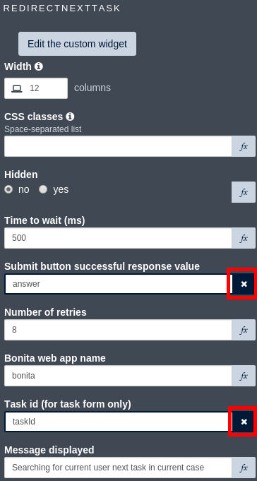
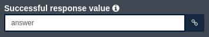

# redirect-next-task-widget
A widget to automatically redirect user to next task after case instantiation or task submission.

## Usage
You need to add the provided custom widget (`redirectNextTask`) to your page and configure the following properties:
- Time to wait (ms): define how long to wait between each API call that will be made to find next task available for current user. Not that attempt will stop after a defined number of tries.
- Submit button successful response value: bind to the variable that is also bind to the submit button "Successful response value" property. **Important:** you need to click on the "fx" button to switch from "constant" to "expression" mode.
- Number of retries: maximum number of calls to the API to get available tasks. A pause will happen after each call. Duration of the pause is defined by "Time to wait (ms)" property. Call will stop when receiving next task information or after "Number of retries" is reached.
- Bonita web app name: the name of Bonita Portal web application. By default "bonita". This will be used to build REST API URL but also to redirect user to Portal welcome page if no tasks are available.
- Task id: bind this to "taskId" variable when you use the widget on a task form. Leave empty if widget is used for case instantiation form. If "taskId" variable does not exist create it and set the type to "URL parameter" and "URL parameter name" to "id". **Important:** you need to click on the "fx" button to switch from "constant" to "expression" mode.
- Message displayed: define the message that should be display to the user while the widget try to find next task.

*redirectNextTask widget configured on a task:*

*submit button widget configured on a task:*

## Important

This widget does not replace the "button" widget with action set to "Start process" or "Submit task".

"Target URL on success" property of submit button must be empty. If you set a value it will conflict with redirect next task custom widget.

## Known limitations
Implementation rely on polling the Engine to get available tasks for current user in current case. Polling approach will lead to an additional load on your Bonita server.

Note that for page flow use cases it is usually a good solution to implement it as a single task form. You can refer to [available example](https://github.com/Bonitasoft-Community/pageflow-form-example) for further details.

## Future improvement
Behavior of this custom widget can be merged with standard button for action set to "Start process" and "Submit task".
